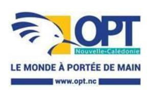

# **DT - Chargé d'affaires Télécom grands comptes stratégiques - AE**

**Référence :** 3134-26-0420/SR du 27 mars 2026

**Employeur :** Office des postes et télécommunications

**Corps ou Cadre d'emploi /Domaine** : cadre **Direction :** Télécom

d'exploitation

**Lieu de travail :** 9 rue du général Gallieni - Nouméa

**Durée de résidence exigée**

**pour le recrutement sur titre (1) : Date limite de candidature :** Vendredi 27 mars 2026

**Postes à pourvoir :** susceptible d'être à pourvoir **Date de dépôt de l'offre :** Vendredi 17 avril 2026

Détails de l'offre :

**Emploi RESPNC : Chargé d'affaires**

**Missions** : Garantir une relation de proximité avec les clients en portefeuille (B to B)

Analyser, identifier, écouter les besoins émis et proposer des solutions

adaptées

**Unité organisationnelle** : Agence Entreprises

**Place dans l'organigramme : N-2** (par rapport au directeur opérationnel)

**Fonction du supérieur hiérarchique direct :** Chef de Section Développement

Clients

### **Nb d'agents encadrés** :

- Directs : / - Indirects : /

# **Activités principales :** Principales :

- Fidéliser les clients B2B par les effets combinés grande proximité et réactivité dans la mise en œuvre d'outils, dispositifs et pratiques commerciales favorisant la captation, l'analyse et le traitement des informations clients,
- Connaître les structures grands comptes (décideurs, produits, perspectives de développement, organisation de leur système de communication) et connaître le marché calédonien,
- Conseiller et vendre aux clients les solutions correspondant à leurs besoins

et en adéquation avec la stratégie de l'OPT,

- Contribuer à la définition et à l'atteinte des objectifs commerciaux,
- Participer à l'élaboration du plan d'actions commerciales en lien avec le chef de section et en assurer la mise en place,
- Assurer l'ingénierie commerciale, ainsi que les étapes de négociation conduisant à l'acceptation des offres émises dans les conditions tarifaires définies,
- Contribuer à l'identification et à la recherche de sources d'amélioration des résultats et des performances commerciales,
- Promouvoir les offres OPT par une information régulière et assurer une

### relation commerciale de qualité

- Participer et être force de proposition lors de l'élaboration des offres en collaboration avec l service marketing et le servie architecture et projet,
- Garantir la transmission des informations aux assistants commerciaux et veiller à la complétude des dossiers clients,
- Assurer le reporting de son activité et proposer à sa hiérarchie des axes d'amélioration et recommandations,
- Veiller à la qualité des données clients dans les systèmes d'information
- Contribuer à la meilleure efficacité collective de l'entité de rattachement par la capacité à tenir d'autres positions, à élever son niveau de pratique, à tutorer (sur la base du volontariat), à conseiller ses collègues,
- Assurer la représentation de l'agence entreprises lors des manifestations (salon, forum, etc)
- Veiller au respect des attendus décrits dans les référentiels de fonction de l'OPT (agents).

# **Caractéristiques particulières de l'emploi** :

- Habilitations, permis nécessaires pour l'exercice des fonctions : Permis de conduire B
- Conditions de travail : du lundi au samedi en fonction du règlement intérieur

### **Profil du candidat** Savoir / Connaissance/Diplôme exigé :

- Outils informatiques et suite MS 365
- Systèmes d'Information et applications métiers liées aux produits et services vendus
- Techniques rédactionnelles et maîtrise de l'orthographe
- Techniques commerciales et conseil au client
- Produits et services télécoms commercialisés par l'OPT-NC
- Organisation de l'OPT-NC
- Processus métiers et interlocuteurs internes
- Techniques de vente (processus de vente : prospection, accueil client, découverte du besoin, présentation produits, négociation, suivi du client…)..

# Savoir-faire :

- Prospecter une clientèle
- Gérer une relation client
- Analyser un besoin
- Conseiller
- Instruire un dossier
- Argumenter
- Rendre compte
- Synthétiser les informations
- Rédiger des comptes rendus
- Travailler en réseau
- S'exprimer à l'oral

# Comportement professionnel :

- Capacité à communiquer
- Sens de la pédagogie
- Aptitude à l'écoute
- Aisance relationnelle
- Faculté d'adaptation
- Faire preuve de discrétion
- Sens de l'organisation
- Avoir l'esprit d'équipe
- Être rigoureux
- Réactivité
- Être autonome

Les compétences suivies de \* pourront être acquises à la suite de la prise de poste via un accompagnement et des formations dispensées au sein de l'office

**Contact et informations** Cheffe de section Développement Clients

**complémentaires :** Tél : 26 77 98

# **POUR RÉPONDRE À CETTE OFFRE**

Les candidatures (CV détaillé, lettre de motivation, photocopie des diplômes, fiche de renseignements, attestation sur l'honneur de non bénéfice de la rupture conventionnelle, ainsi que la demande de changement de corps ou cadre d'emplois si nécessaire (2)) précisant la référence de l'offre doivent parvenir à la Direction des ressources humaines, Bureau recrutement, mobilité, accompagnement par :

- Voie postale : Direction Générale 2 rue Montchovet, Port Plaisance 98841 NOUMÉA Cedex
- Dépôt physique (adresse) : idem que ci-dessus
- Mail (adresse) : drh-candidature@opt.nc

(1) Vous trouverez la liste des pièces à fournir afin de justifier de la citoyenneté ou de la durée de résidence dans le document intitulé "Notice explicative : pièces à fournir pour justifier de votre citoyenneté ou de votre résidence" qui est à télécharger directement sur la page de garde des avis de vacances de poste sur le site de la DRHFPNC.

(2) La fiche de renseignements et la demande de changement de corps ou cadre d'emploi sont à télécharger directement sur la page de garde des avis de vacances de poste sur le site de la DRHFPNC. Toute candidature incomplète ne pourra être prise en considération.

*Les candidatures de fonctionnaires doivent être transmises sous couvert de la voie hiérarchique*