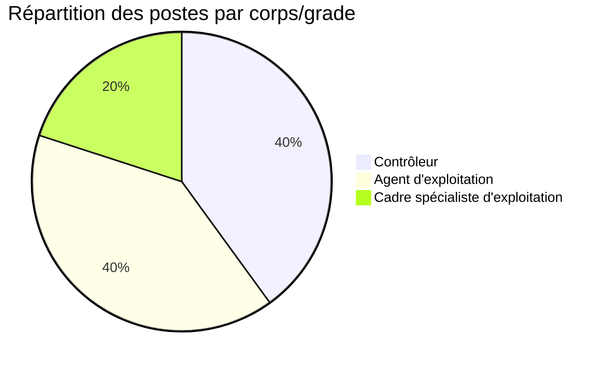
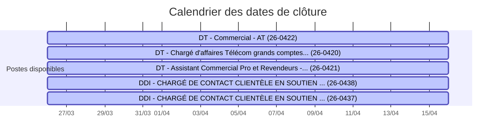

# AVPS OPT-NC

Bienvenue sur le site des **Avis de Vacances de Poste** de l'Office des Postes et Télécommunications de Nouvelle-Calédonie.

## 📊 En bref

- **5** postes disponibles actuellement
- 📅 Dernière mise à jour : **12/04/2026 à 11h30** (Nouméa)
- 🔄 Prochaine mise à jour : demain à 00h00 (automatique)

### 📈 Répartition par corps/grade

### 📅 Timeline des dates de clôture

> 💡 **Légende** : 🟢 Vert = Plus de 7 jours | 🔵 Bleu = 3 à 7 jours | 🔴 Rouge = Moins de 3 jours (urgent !)

---

## 📋 Postes disponibles

Cette page recense les avis de vacances de poste publiés par l'OPT-NC, issus du dataset [avis-de-vacances-de-poste-avp-drhfpnc](https://data.gouv.nc/explore/dataset/avis-de-vacances-de-poste-avp-drhfpnc/information) disponible sur data.gouv.nc.

👉 **Retrouvez également les AVP sur le [site institutionnel OPT-NC](https://office.opt.nc/fr/emploi-et-carriere/postuler-lopt-nc/avp)**

### Liste des AVP disponibles

!!! info "26-0438 - DDI - CHARGÉ DE CONTACT CLIENTÈLE EN SOUTIEN - ZN VOH-KONÉ-POUEMBOUT 🟢 J-3"
    **🏢 Direction :** Office des postes et télécommunications (OPT)  
    **📅 Date limite :** 16/04/2026  
    **💼 Corps :** Agent d'exploitation  
    **⚡ Disponibilité :** Immédiate  
    
    [📖 Voir les détails](26-0438/){ .md-button } [📄 Télécharger le PDF](https://data.gouv.nc/explore/dataset/avis-de-vacances-de-poste-avp-drhfpnc/files/4c30caa0b55abc63564ce9194ae06de9/download/){ .md-button .md-button--primary target="_blank" }

!!! info "26-0437 - DDI - CHARGÉ DE CONTACT CLIENTÈLE EN SOUTIEN - ZN OUÉGOA-POUÉBO 🟢 J-3"
    **🏢 Direction :** Office des postes et télécommunications (OPT)  
    **📅 Date limite :** 16/04/2026  
    **💼 Corps :** Agent d'exploitation  
    **⚡ Disponibilité :** Immédiate  
    
    [📖 Voir les détails](26-0437/){ .md-button } [📄 Télécharger le PDF](https://data.gouv.nc/explore/dataset/avis-de-vacances-de-poste-avp-drhfpnc/files/90b867f7edd4944c0992eb3e489c122b/download/){ .md-button .md-button--primary target="_blank" }

!!! info "26-0422 - DT - Commercial - AT 🟢 J-3"
    **🏢 Direction :** Office des postes et télécommunications (OPT)  
    **📅 Date limite :** 16/04/2026  
    **💼 Corps :** Contrôleur  
    **⚡ Disponibilité :** Immédiate  
    
    [📖 Voir les détails](26-0422/){ .md-button } [📄 Télécharger le PDF](https://data.gouv.nc/explore/dataset/avis-de-vacances-de-poste-avp-drhfpnc/files/1d35b378fa0b24d7397ffb16e2a9b2aa/download/){ .md-button .md-button--primary target="_blank" }

!!! info "26-0421 - DT - Assistant Commercial Pro et Revendeurs - AE 🟢 J-3"
    **🏢 Direction :** Office des postes et télécommunications (OPT)  
    **📅 Date limite :** 16/04/2026  
    **💼 Corps :** Contrôleur  
    **⚡ Disponibilité :** Immédiate  
    
    [📖 Voir les détails](26-0421/){ .md-button } [📄 Télécharger le PDF](https://data.gouv.nc/explore/dataset/avis-de-vacances-de-poste-avp-drhfpnc/files/fafff45544298630ae00430fd07ef837/download/){ .md-button .md-button--primary target="_blank" }

!!! info "26-0420 - DT - Chargé d'affaires Télécom grands comptes stratégiques - AE 🟢 J-3"
    **🏢 Direction :** Office des postes et télécommunications (OPT)  
    **📅 Date limite :** 16/04/2026  
    **💼 Corps :** Cadre spécialiste d'exploitation  
    **⚡ Disponibilité :** Immédiate  
    
    [📖 Voir les détails](26-0420/){ .md-button } [📄 Télécharger le PDF](https://data.gouv.nc/explore/dataset/avis-de-vacances-de-poste-avp-drhfpnc/files/890eeb92e19eff0575cd52f616ff56c6/download/){ .md-button .md-button--primary target="_blank" }

## 📝 Comment postuler ?

Pour candidater à un poste :

1. **Consultez l'offre** qui vous intéresse ci-dessus
2. **Téléchargez le PDF** pour connaître tous les détails et critères requis
3. **Préparez votre dossier** de candidature selon les modalités indiquées dans l'AVP
4. **Déposez votre candidature** avant la date limite auprès du service RH de l'OPT-NC

💡 **Plus d'informations** : Rendez-vous sur le [site institutionnel OPT-NC](https://office.opt.nc/fr/emploi-et-carriere/postuler-lopt-nc/avp) pour connaître les modalités de candidature et les contacts RH.

---

## 🔄 Mise à jour

Les données sont mises à jour quotidiennement de manière automatique.

---

*Données extraites de [data.gouv.nc](https://data.gouv.nc)*
