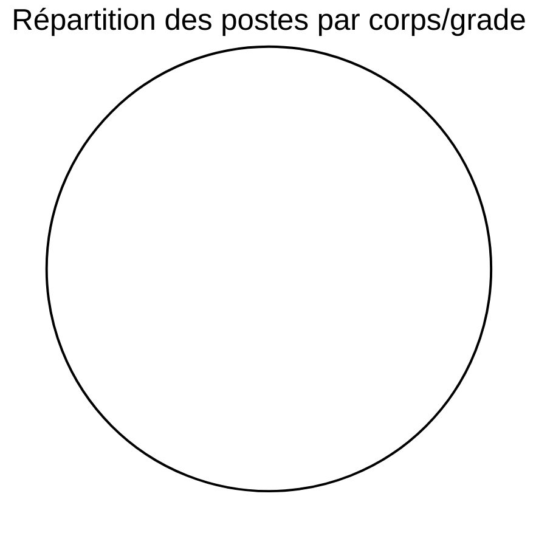

# AVPS OPT-NC

Bienvenue sur le site des **Avis de Vacances de Poste** de l'Office des Postes et Télécommunications de Nouvelle-Calédonie.

## 📊 En bref

- **0** poste disponible actuellement
- 📅 Dernière mise à jour : **18/04/2026 à 11h20** (Nouméa)
- 🔄 Prochaine mise à jour : demain à 00h00 (automatique)

### 📈 Répartition par corps/grade

---

## 📋 Postes disponibles

Cette page recense les avis de vacances de poste publiés par l'OPT-NC, issus du dataset [avis-de-vacances-de-poste-avp-drhfpnc](https://data.gouv.nc/explore/dataset/avis-de-vacances-de-poste-avp-drhfpnc/information) disponible sur data.gouv.nc.

👉 **Retrouvez également les AVP sur le [site institutionnel OPT-NC](https://office.opt.nc/fr/emploi-et-carriere/postuler-lopt-nc/avp)**

### Liste des AVP disponibles

## 📝 Comment postuler ?

Pour candidater à un poste :

1. **Consultez l'offre** qui vous intéresse ci-dessus
2. **Téléchargez le PDF** pour connaître tous les détails et critères requis
3. **Préparez votre dossier** de candidature selon les modalités indiquées dans l'AVP
4. **Déposez votre candidature** avant la date limite auprès du service RH de l'OPT-NC

💡 **Plus d'informations** : Rendez-vous sur le [site institutionnel OPT-NC](https://office.opt.nc/fr/emploi-et-carriere/postuler-lopt-nc/avp) pour connaître les modalités de candidature et les contacts RH.

---

## 🔄 Mise à jour

Les données sont mises à jour quotidiennement de manière automatique.

---

*Données extraites du dataset [avis-de-vacances-de-poste-avp-drhfpnc](https://data.gouv.nc/explore/dataset/avis-de-vacances-de-poste-avp-drhfpnc) disponible sur data.gouv.nc*
